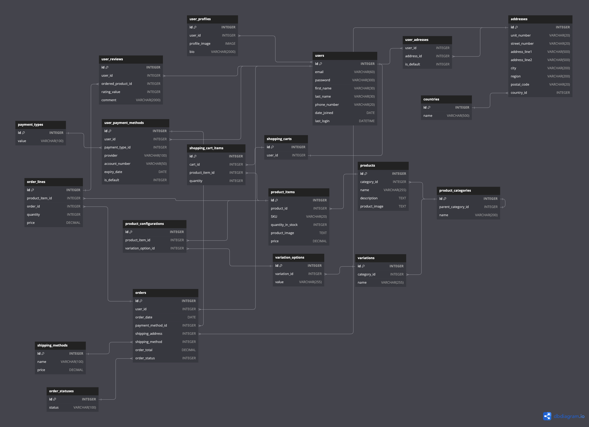

# E-commerce API

This project is an E-commerce API built with Django Rest Framework.

## ER Diagram

The Entity-relationship diagram was built using https://dbdiagram.io/

## To start

Clone the project and run `docker-compose run --build`
